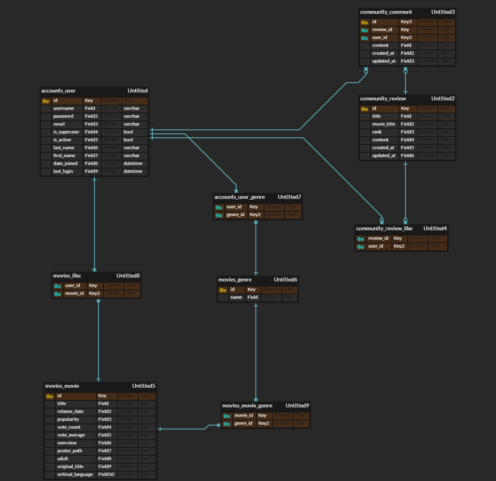

# 영화 정보 API를 활용한 관통 프로젝트

[TOC]

# 프로젝트 실행 :runner:

- final-pjt-back에서
  - `python -m venv venv`
  - `source venv/Scripts/activate`
  - (DB 관련 자료를 다 날렸다면, 선택사항) 
    - `python manage.py makemgrations`
  - 최초 실행 시
    - 데이터베이스 생성
      - `python manage.py migrate`
    - json 데이터를 DB에 dump
      - `python manage.py loaddata movies/fixtures/tmdb.json`
  - `python manage.py runserver`
- final-pjt-front에서
  - `npm run serve`

# 프로젝트 구조 :gear:

- Vue.js, vuex, vuetify를 사용한 반응형 웹 프론트엔드 구현
- Django REST API 백엔드 구현
- TMDB API 사용

# 프로젝트 설명 👨‍💻👩‍💻

## 팀원 정보 및 업무 분담 내역

- 김민경 (BACKEND)
  - Django REST API 서버 구현
  - CSS
  - PPT 제작
  - 발표영상 제작
- 최준원 (FRONTEND)
  - Vue.js, vuex, vue-router, vuetify를 활용한 반응형 웹 구현
  - vue-tinder (카드를 넘기는 기능) 구현
  - 영화 추천 알고리즘 설계

## 목표 서비스 구현 및 실제 구현 정도

- vuetify를 사용해 보다 부드러운 UI로 구성했습니다.
- 가장 큰 목표였던 틴더 서비스 구현에 성공했습니다.

## 데이터베이스 모델링(ERD)



## 필수 기능에 대한 설명

### A. 관리자 뷰

- django의 admin 기능을 이용하여 구현

### B. 영화 정보

- TMDB API를 사용해서 9,974개의 데이터를 json 파일로 변환한 이후, dump
- 모든 로그인 된 유저가 평점 등록 / 수정 가능


### C. 추천 알고리즘

- 틴더와 같이 영화 포스터를 휙휙 넘겨가며 사용자가 선호하는 장르 데이터를 수집하고, 이를 바탕으로 영화를 추천해주는 기능을 구현


### D. 커뮤니티

- 리뷰, 댓글을 남길 수 있는 커뮤니티 기능 구현
- 로그인한 사용자만 조회 / 생성 할 수 있으며 작성자 본인만 글의 수정 / 삭제 가능
- 리뷰의 작성 및 삭제는 동기, 댓글의 작성, 수정, 삭제, 리뷰의 수정은 비동기로 처리
- 각 리뷰 및 댓글의 생성 및 수정 시각 정보 포함

### E. 기타

- 크게 영화 정보, 추천 페이지, 틴더 페이지, 커뮤니티 페이지 등의 다양한 URL
- HTTP method와 상태 코드를 상황에 맞게 리턴
- axios를 활용한 비동기 요청으로 UX 향상

## 기타(느낀점) ✍

### 김민경

```tex
Git-flow를 쓰면서 처음으로 git의 위대함을 느꼈다.
코드가 겹쳐도 수정이 바로바로 가능하고 알집으로 일일이 작업을 하지 않아도 되고 명령어만 잘 숙지하고 이해하면 돼서
적응한 후에는 Git-flow가 정말 편했다.
팀원 준원이오빠가 Git-flow를 가르쳐주지 않았다면 나는 압축파일을 하루에 몇개나 만들었을까..ㅎ
back-end를 맡으면서 django를 제대로 복습하는 기회가 되었다.
✔ 일단, 처음에 모델링을 제대로 잡고가는 것이 정말 중요하다는 것을 알게 되었다.
	간단한 부분을 수정하긴 했지만 데이터를 처리하는 로직을 짜면서 모델을 많이 고치면서 느꼈다.
✔ 그리고 serializer에 필요한 필드를 선정하는 것도 고민이 필요했다.
	vue로 어떠한 정보를 넘길지 고민하는 것이 중요한 것 같다.
✔ 영화 평점 기능을 구현하면서 어떠한 앱에 평점 모델을 쓸 것인가, 그리고 어디서 그 평점을 어떻게 보여줄지도 난제였다.
	결국 movie랑 연결하지는 못했다.	
✔ 추천 알고리즘을 짜면서 랜덤으로 movie를 200개 정도 보내는 것은 구현했지만 tinder에서 사용자가 선호하는 장르를
	담아서 추천하는 코드는 준원이 오빠가 구현했다. 시간이 조금 많았다면 느려도 내가 구현해서 넘겨줘야 했었는데..
	그래도 준원이 오빠가 코드를 짜는 것을 같이 보면서 코드에 대한 센스를 배울 수 있었다.
✔ 마지막으로 movie Detail 페이지의 css를 시도했다. back-end는 어려워도 재미는 있는 것 같은데 front는 왜... 재미도 없고
	어려울까..ㅎㅎ css와 vue의 부족함을 더 채워야할 필요성을 느꼈다.
진도가 조금 느려서 새벽까지 준원이 오빠와 프로젝트를 해야했다. 서로 응원해주면서 잘 이겨낸 것 같다.
준원이 오빠에게 많은 부분을 배워서 정말 유익한 프로젝트 기간이였다.
소통이 잘 되고 협업툴 뿐만아니라 코드에 대한 이해도도 깊은 팀원을 만나서 짧지만? 길었던 첫 프로젝트를 잘 마무리 한 것 같다.
아롱이와 몽이 팀 너무 고생했고 준원이오빠, 서툴러도 계속 응원해줘서 너어무 고마워 고생했어ㅎㅎ😝
```

### 최준원

```tex
저번 프로젝트에서는 적용하지 못했던 Git-Flow 방식으로 협업했고 아직 Git 마스터라고 할 수는 없지만 
조금 더 능숙해졌다.

그래도 항상 프로젝트에는 아쉬움이 남는다. 적어 보자면...

✔ 초반에 ERD를 작성하고, 프로젝트를 설계하고 시작했음에도 개발을 진행하면서 고친 부분이 적지 않았다. 
	초반 설계를 틀어야 하니 까딱하면 오류가 날 수 있어 작업이 까다로웠고, 설계의 중요성을 다시 한번 느꼈다.

✔ 개발에 있어 우선사항을 고려하는 것이 중요한데 개인적인 욕심 때문에 지나치게 깊게 파고 들어가느라
	전체적인 일정이 미뤄진 점이 아쉬웠다. 다음에는 비슷한 실수를 줄일 것이다.

반면 얻어가는 것도 많다.

✔ 프로젝트에 최선을 다하는 배려심 많은 팀원과의 협업은 오랜만이라 너무 재미있었다. 
	새벽까지 코딩하고 마지막에는 결국 밤을 샜지만...ㅎㅎ 서로 격려하면서 큰 스트레스는 받지 않고 끝을 냈다.

✔ 기한은 다소 짧지만, 여러 가지 기능을 우겨넣어 볼 수 있었던 재미있는 시간이었다. 
	컴포넌트를 바탕으로 하는 React, Vue 프레임워크의 강력함을 느낄 수 있었다. 
	다음 프로젝트에는 보다 깔끔한 코드를 능숙하게 구현해 보고 싶다.

부족한 실력에도 욕심이 많아 작업이 느린 프론트엔드의 속도에 답답했을 텐데도 
자기 일을 묵묵히 해준 민경아, 고마워! 👏

```


# 개발 진행 중 참고사항

## git-flow

- 기능 구현 시, feature 별로 새로운 branch 생성. ex) `feature/back/<feature_name>`, `feature/front/<feature_name>`
- 작업 완료 후, Pull Request
- merge된 branch는 삭제

```sh
# 새로운 작업 branch 생성 (꼭 develop branch에서 새로운 branch 파기)
git checkout -b feature/front/movies_list_page
# 원격 branch 가져오기
git checkout -t <branch_name>
```

## notion
- [노션](https://www.notion.so/engcraft/06ab1b20a4ed4013b0b27ba6f80fa090)
- 개발 진행상황, 마일스톤 등의 정보를 모아놓은 노션 페이지

## Git-Convention

커밋 메시지, 풀 리퀘스트 커밋 컨벤션입니다.

간단한 내용일 경우 제목만 적어도 무방합니다! 내용도 심플하게 적어 주세요.

```
# <타입>: <제목>

##### 제목은 최대 50 글자까지만 입력 ############## -> |

# 본문은 위에 작성
######## 본문은 한 줄에 최대 72 글자까지만 입력 ########################### -> |

# (선택사항) 꼬릿말은 아래에 작성:
    ex)
    Resolves: #이슈 번호
    See also: #이슈 번호, #이슈 번호

# --- COMMIT END ---
# <타입> 리스트
#   feat    : 기능 (새로운 기능)
#   fix     : 버그 (버그 수정)
#   refactor: 리팩토링
#   style   : 스타일 (코드 형식, 세미콜론 추가: 비즈니스 로직에 변경 없음)
#   docs    : 문서 (문서 추가, 수정, 삭제)
#   test    : 테스트 (테스트 코드 추가, 수정, 삭제: 비즈니스 로직에 변경 없음)
#   chore   : 기타 변경사항 (빌드 스크립트 수정 등)
# ------------------
#     제목 첫 글자를 대문자로
#     제목은 명령문으로
#     제목 끝에 마침표(.) 금지
#     제목과 본문을 한 줄 띄워 분리하기
#     본문은 "어떻게" 보다 "무엇을", "왜"를 설명한다.
#     본문에 여러줄의 메시지를 작성할 땐 "-"로 구분
# ------------------
```

### **예시**

```
feat: 메인 페이지에 무한 스크롤 추가

내용내용내용내용내용내용내용내용내용내용내용
내용내용내용내용내용내용내용내용내용내용내용
내용내용내용내용내용내용내용내용내용내용내용
내용내용내용내용내용내용내용내용내용내용내용

Resolves: #119
```

### **Resolves ?**

어떠한 이슈를 해결한 후, 위의 #119와 같이 119번 이슈로 바로 이동할 수 있는 링크를 생성합니다.

이를 통해 편하게 어떤 Issue에 관련된 커밋/풀 리퀘스트인지 빠르게 파악할 수 있습니다.
