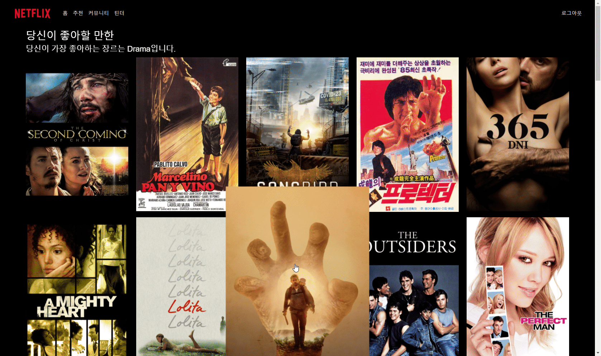
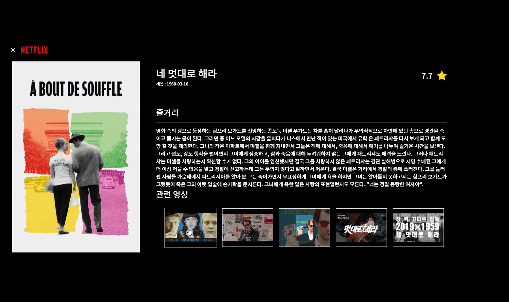

# MOVIE_TINDER

영화 정보 제공, 추천 프로젝트

영화의 정보를 제공하는 사이드 프로젝트입니다. 리뷰와 댓글의 작성, 수정, 삭제가 가능한 기본적인 커뮤니티 기능이 포함되어 있습니다.

기본적으로 구현해야 하는 부분을 제외하고, 서비스의 차별화를 위해서는 "어떻게 추천할 것인가" 에 대한 고민이 필요했습니다. 회원 가입할 때 좋아하는 장르를 입력받을까? 영화에 좋아요 기능을 달아서 그 데이터를 기반으로 추천할 것인가? 모두 식상하게 느껴졌습니다. 실제 업무가 아니기 때문에 제가 해 보고 싶은 대로, 넣고 싶은 기능을 마구 넣어 보고 싶었습니다.

궁리 끝에 소개팅 어플리케이션 틴더에서 영감을 받아, 영화 포스터를 좌우로 넘기면서 사용자의 데이터를 입력받고 그에 따라 영화를 추천한다는 아이디어가 떠올라 구현해 보기로 했습니다. "영화와의 소개팅" 이죠.

포스터를 휙휙 넘기면서 "오? 이런 영화도 있네?" 혹은 "심심한데 영화 포스터나 넘겨 볼까" 하는 느낌의 사용자 경험을 제공함으로써 습관적으로 이용할 수 있게 하는 것이 목표였습니다. 특별히 할 일이 없어도 습관적으로 SNS를 켜는 것처럼 자연스럽게 서비스를 이용하게 하는 것이 조용하지만 강력한 경쟁력이라고 생각했기 때문입니다.

## Requirements

- Vue.js, vuex, vue-router, vuetify
- Django

frontend, backend 폴더 내의 package.json, requirements.txt에 필요한 모듈이 명시되어 있습니다.

## Getting Started

### 각각의 폴더로 들어간 뒤 터미널에 명령을 입력하세요.

- backend 폴더에서
  - `python -m venv venv`
  - `source venv/Scripts/activate`
  - 최초 실행할 경우 꼭 수행
    - 데이터베이스 생성
      - `python manage.py migrate`
    - json 데이터를 DB에 dump
      - `python manage.py loaddata movies/fixtures/tmdb.json`
  - `python manage.py runserver`
- frontend 폴더에서
  - `npm i`
  - `npm run serve`

## Note

Youtube API를 발급받으신 후, frontend 루트 디렉토리에 .env.local 파일을 만들어 주세요.

```
.env.local

VUE_APP_YOUTUBE_API=your_youtube_api_key
```

## Blog

- [프로젝트에 대해 정리한 글](https://jdev.tistory.com/76)

## Screen Shot

### main


### detail - 1



### detail - 2s



### tinder


